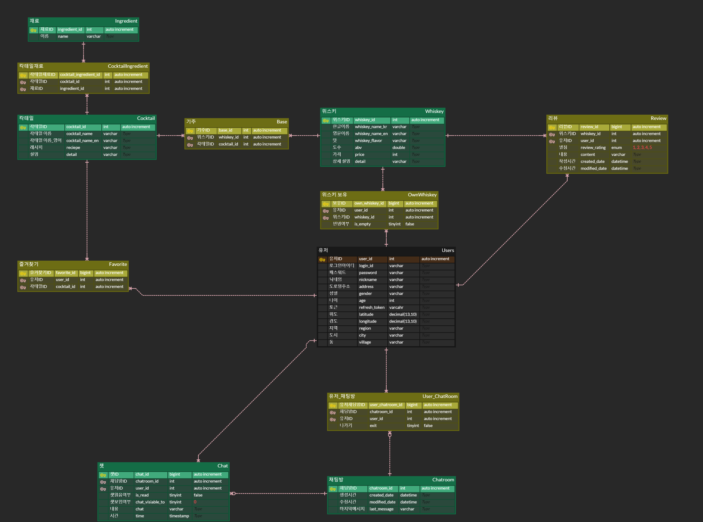
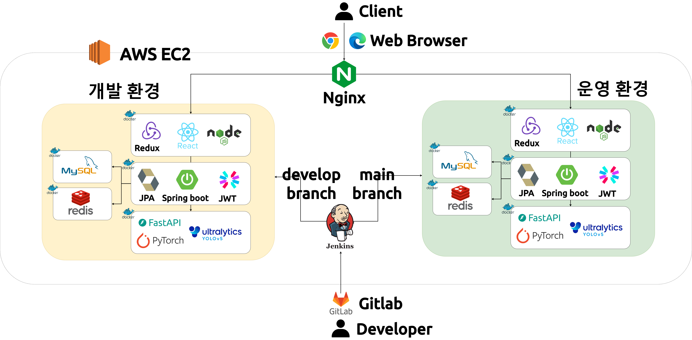

# 🍾 Whiskey Wiki

## Index
  - [Introduction](#introduction) 
  - [Features](#features)
  - [Documentation](#documentation)
  - [Technical Stacks](#technical-stacks)
  - [Team](#team)

  
## Introduction
### Overview
Whiskey Wiki is a service designed for whiskey beginners. 
It provides an image detection AI service to help users find whiskey names, a My Bar feature for online storage and management of whiskey, and functionalities to access various whiskey information and communicate with other users.

### Duration and Team
Duration: 2024. 02. 26 - 2024. 04. 04 (6 weeks) 
Team : 6 members  
 

## Features

  
<h3>AI 인식으로 위스키 이름 찾기</h3>
 
  

- Upload a photo to find the whiskey's name and information.
- The found whiskey can be registered in My Bar.
- Utilizes a YOLOv5 model trained on a custom dataset.

  
<h3>내 위스키를 저장하는 마이바(My Bar)</h3>

  .gif)

  - A personal bar to save whiskeys found through AI recognition.
  - If you've finished a bottle, you can switch its status to empty.

  
<h3>다양한 위스키 정보</h3>

  

  - View various whiskeys' alcohol content, flavor profiles, price ranges, reviews, and cocktail recipes.
  - Sort by name, price, and more.

  
<h3>지도에서 다른 사람의 마이바 구경, 교환 신청</h3>

  

  - Explore nearby users' My Bars based on your location.
  - Utilizes the Kakao map API.

 

## Documentation

### Porting Guide (exec)
- DB dump files: data.sql / schema.sql 

### Wireframes & Mockups

👉 [Figma - Link](https://www.figma.com/file/5JPFZwNMkIZ8hfc880JaEb/Untitled?type=design&node-id=0-1&mode=design&t=rFBealktMFGV35cx-0)

### API specification

👉 [API Specification - Link](https://galvanized-citron-903.notion.site/API-efca2cccd96d43af85d259b38291cd82?pvs=4)

  
<h3>ERD</h3>

  

  
<h3>System Architecture</h3>

  
  

 

## Technical Stacks

### Front-End

-61DAFB?style=for-the-badge&logo=react&logoColor=white>) 
-06B6D4?style=for-the-badge&logo=redux&logoColor=white>)
-339933?style=for-the-badge&logo=node.js&logoColor=white>) 
-2C8EBB?style=for-the-badge&logo=npm&logoColor=white>) 
 

 
 

### Back-End

 
-6DB33F?style=for-the-badge&logo=Springboot&logoColor=white>) 
-3776AB?style=for-the-badge&logo=Python&logoColor=white>)
-009639?style=for-the-badge&logo=fastapi&logoColor=white>)
 
-4479A1?style=for-the-badge&logo=mysql&logoColor=white>) 
-DC382D?style=for-the-badge&logo=redis&logoColor=white>) 
-964B00?style=for-the-badge&logo=hibernate&logoColor=white>)

### AI

-3776AB?style=for-the-badge&logo=Python&logoColor=white>)
-F05032?style=for-the-badge&logo=pytorch&logoColor=white>) 

### CI/CD

 
-FF9900?style=for-the-badge&logo=amazonec2&logoColor=white>) 
-FF9900?style=for-the-badge&logo=amazonec2&logoColor=white>) 
  
-2496ED?style=for-the-badge&logo=docker&logoColor=white>) 
-2496ED?style=for-the-badge&logo=docker&logoColor=white>) 
-009639?style=for-the-badge&logo=nginx&logoColor=white>) 
-D24939?style=for-the-badge&logo=Jenkins&logoColor=white>)

### IDE

-3178C6?style=for-the-badge&logo=v&logoColor=white>) 
-F23920?style=for-the-badge&logo=intellij&logoColor=white>)

### Tools

 
 
 

 

 

## Team
|  이지은  |  안윤철  |  임현승  |  장세영  |  조담현  |  조연주  |
| :-----: | :-----: | :-----: | :-----: | :-----: | :-----: |
|  |  |  |  |  |  |
| PM / Frontend  | Backend / AI | Backend | Frontend | Backend / Infra | AI / Frontend |

<!-- |  이름  |             사진             | 담당 역할                                                                                                                                                                                                                                                                       |
| :----: | :--------------------------: | :------------------------------------------------------------------------------------------------------------------------------------------------------------------------------------------------------------------------------------------------------------------------------ |
| 이지은 |  | - PM : 프로젝트 팀장, Git, Jira, 일정관리 및 정리, 최종발표   - Frontend : 마이바(My Bar), 지도(Exchange Map) 페이지 기능 구현 및 CSS   - Design : 와이어 프레임 제작 / 마이바(My Bar) 관련 페이지 디자인                                                                 |
| 안윤철 |  | - Backend : ERD 설계 / Auth(인증,인가) / refresh token 저장, 접근을 위한 Redis 사용, Users(유저 정보 관리), 채팅 관련 API 작성 - AI : Fast API, 커스텀 데이터셋 제작, 모델 학습 및 테스트                                                                                                                                 |
| 임현승 |  | - Backend : ERD 설계 / JPA를 활용한 메인 API 작성   (위스키, 마이바, 지도, 칵테일, 즐겨찾기, 리뷰 관련 API 작성)                                                                                                                                                             |
| 장세영 |  | - Frontend : 개인정보 조회 및 수정, 위스키 정보 및 상세 페이지 기능 구현 및 CSS   - Design : 와이어 프레임 제작 / 로고 디자인   - Archives : 팀 관련 미팅 기록 및 정리                                                                                                    |
| 조담현 |  | - Backend : ERD 설계   - Infra : 시스템 아키텍처 설계 / Docker, Docker-Compose, Nginx, Jenkins, Gitlab를 활용한 CI/CD 파이프라인 구축 / 브랜치별로 webhook을 trigger하여 jenkins에서 자동 빌드 및 blue-green 무중단 배포 구현   - Director : 프로젝트 UCC 촬영/편집                          |
| 조연주 |  | - AI : 커스텀 데이터셋 제작, 모델 학습 및 테스트   - Frontend : 메인, 회원가입, auth(인증/인가), AI 인식, 채팅(웹소켓) 페이지 기능 구현 및 CSS / Redux, persist 설정 / axios interceptor 설정   - Design : 메인, 위스키 정보, AI 위스키 등록, 교환, 채팅, 유저관련 페이지 디자인 |-->
