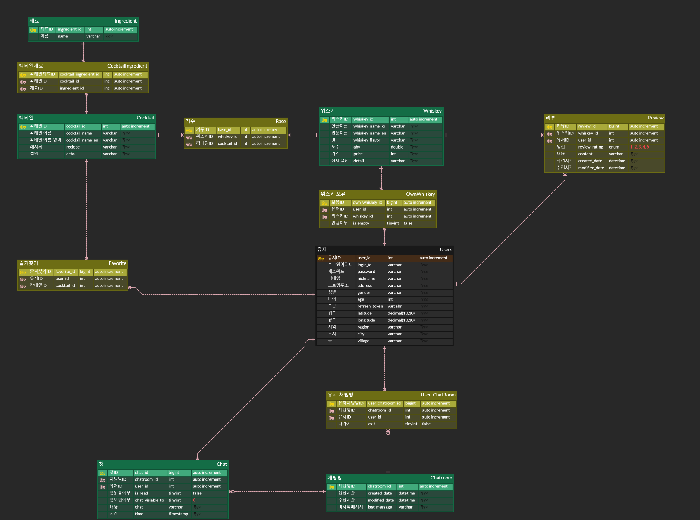
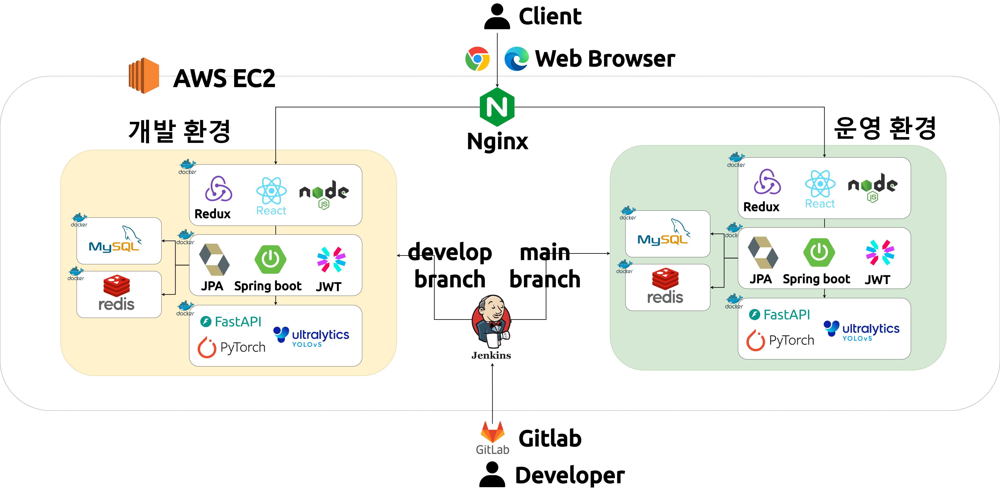

# 🍾 Whiskey Wiki

## Index
  - [Introduction](#introduction)
  - [Technical Stacks](#technical-stacks)
  - [Features](#features)
  - [Documentation](#documentation)
  - [Team](#team)
 

  
## Introduction
### Overview
Whiskey Wiki is a service for whiskey beginners. 
It provides image detection AI service to help users find whiskey names, My Bar feature for online storage and management of whiskey, and functionalities to access various whiskey information and communicate with other users.

### Duration and Team
Duration: 2024. 02. 26 - 2024. 04. 04 (6 weeks) 
Team : 6 members  
 

## Technical Stacks

|  |   |
|----|---|
| **FE** | -61DAFB?style=flat&logo=react&logoColor=white) -06B6D4?style=flat&logo=redux&logoColor=white) -339933?style=flat&logo=node.js&logoColor=white) -2C8EBB?style=flat&logo=npm&logoColor=white)      |
| **BE** |  -6DB33F?style=flat&logo=springboot&logoColor=white) -3776AB?style=flat&logo=python&logoColor=white) -009639?style=flat&logo=fastapi&logoColor=white)   -4479A1?style=flat&logo=mysql&logoColor=white) -DC382D?style=flat&logo=redis&logoColor=white) -964B00?style=flat&logo=hibernate&logoColor=white) |
| **AI** | -3776AB?style=flat&logo=python&logoColor=white) -F05032?style=flat&logo=pytorch&logoColor=white)   |
| **Infra** |  -FF9900?style=flat&logo=amazonec2&logoColor=white) -FF9900?style=flat&logo=amazonec2&logoColor=white)   -2496ED?style=flat&logo=docker&logoColor=white) -2496ED?style=flat&logo=docker&logoColor=white) -009639?style=flat&logo=nginx&logoColor=white) -D24939?style=flat&logo=Jenkins&logoColor=white) |
| **IDE** | -3178C6?style=flat&logo=v&logoColor=white) -F23920?style=flat&logo=intellij&logoColor=white) |
| **Tools** |      |

 

## Features

  
<h3>Find Whiskey Names by AI Image Detection</h3>
 
  

- Upload a photo to find the whiskey's name and information.
- The found whiskey can be registered in My Bar.
- Utilizes a YOLOv5 model trained on a custom dataset.

  
<h3>Save Whiskey in My Bar</h3>

  .gif)

  - A personal bar to save whiskeys found through AI recognition.
  - If you've finished a bottle, you can switch its status to empty.

  
<h3>Various Whiskey Information</h3>

  

  - View various whiskeys' alcohol content, flavor profiles, price ranges, reviews, and cocktail recipes.
  - Sort by name, price, and more.

  
<h3>Explore Other Users' Bars on the Map</h3>

  

  - Explore nearby users' My Bars based on your location.
  - Utilizes the Kakao map API.

 

## Documentation

### Porting Guide (exec)
👉 [Porting Guide](https://github.com/Ivvi-a/Whiskey-Wiki/blob/main/exec/%ED%8F%AC%ED%8C%85%20%EB%A9%94%EB%89%B4%EC%96%BC.pdf)  
- DB dump files: data.sql / schema.sql

### Wireframes & Mockups

👉 [Figma link](https://www.figma.com/file/5JPFZwNMkIZ8hfc880JaEb/Untitled?type=design&node-id=0-1&mode=design&t=rFBealktMFGV35cx-0)

### API specification

👉 [Notion link](https://galvanized-citron-903.notion.site/API-efca2cccd96d43af85d259b38291cd82?pvs=4)

### ERD

### System Architecture

 

## Team
|  이지은  |  안윤철  |  임현승  |  장세영  |  조담현  |  조연주  |
| :-----: | :-----: | :-----: | :-----: | :-----: | :-----: |
|  |  |  |  |  |  |
| PM / Frontend  | Backend / AI | Backend | Frontend | Backend / Infra | Frontend / AI |
